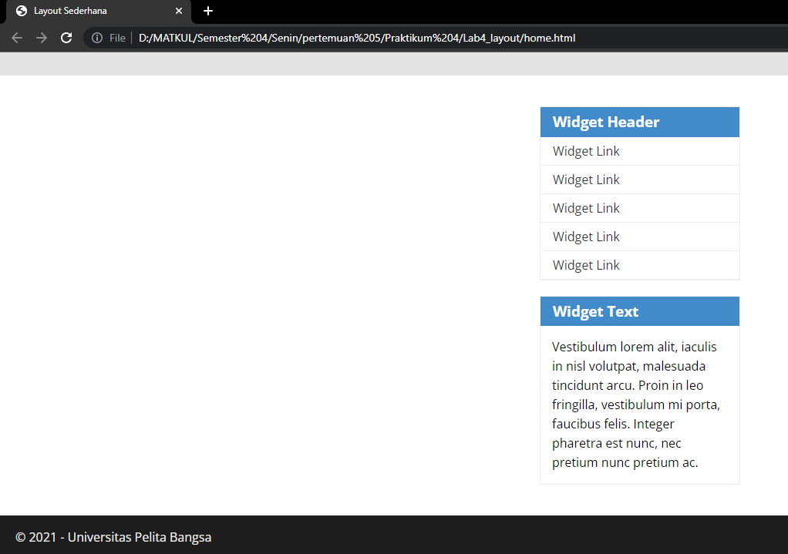
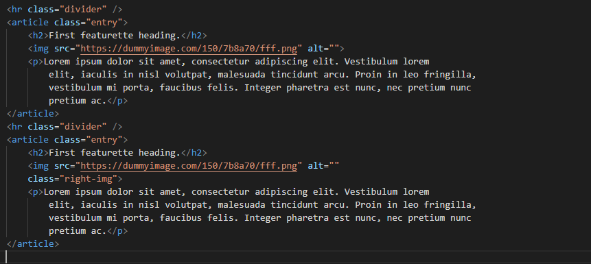

## Mempelajari Membuat Layout

# Langkah-langkah

1. Membuat dokumen HTML dengan dengan nama file lab4_box.html.

* Kemudian menambahkan kode untuk membuat box element.

* Lalu menambahkan deklarasi CSS pada head untuk membuat float element.

* Maka hasil pada google akan menjadi seperti berikut.

2. Mengatur clearfix element dan menambahkan element div lainnya setelah div3.

* Kemudian atur property clear pada CSS.

* Maka kembali ke google lalu gambar akan ada perubahan.

## Membuat Layout Sederhana

# Langkah-langkah

1. Membuat folder baru dengan nama lab4_layout, kemudia buatlah file baru di dalamnya dengan nama home.html, dan file css dengan nama style css.

* Kemudian menambahkan kode seperti berikut.

* Kemudian buka google lalu akan menampilkan gambar berikut.

2. Kemudian menambahkan kode CSS untuk membuat layoutnya.

* Maka akan ada perubahan pada gambar seperti berikut.

3. Membuat Navigasi.

* Kemudian lihat hasilnya.

4. Membuat panel dan tambahkan kode HTML dan CSS seperti berikut.

* Maka hasilnya akan seperti berikut.

5. Mengatur Layout main content dan sidebar dan tambahkan CSS float.

* Membuat sidebar widget dan menambahkan element dalam sidebar.

* Lalu tambahkan CSS.

* Maka hasilnya akan seperti berikut.

6. Mengatur tampilan footer dan tambahkan CSS untuk footer.

* Maka tampilan nya akan seperti ini

7. Menambahkan element lainnya pada main content.

* Kemudian menambahkan CSS.

* Maka hasilnya akan seperti berikut.

8. Membuat content artikel, lalu tambahkan HTML pada main content.

* Kemudian tambahkan CSS.

* Maka gambar akan menjadi seperti berikut.
